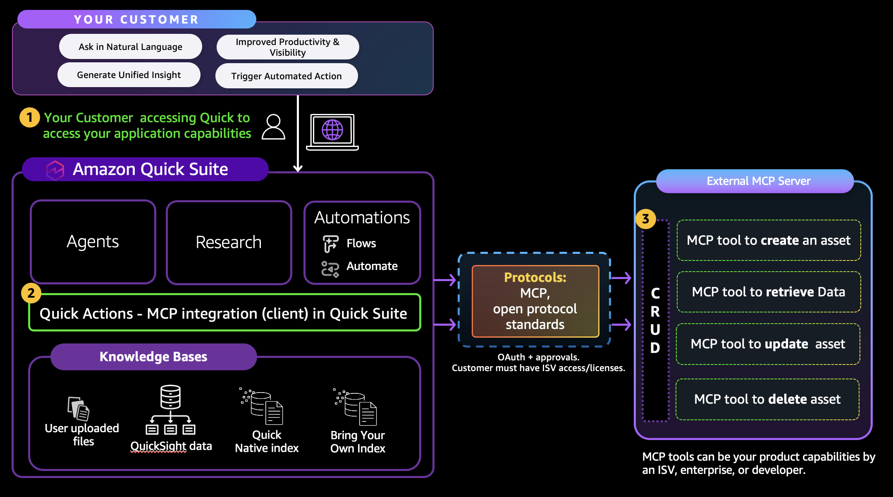

# Build Your Custom MCP Server Using AgentCore Gateway and Connect with Quick

Customers build AI agents and automations in Amazon Quick to analyze data, search enterprise knowledge, and run workflows across their business. Amazon Quick is a unified agentic AI workspace that empowers teams to analyze data, build intelligent agents, discover enterprise knowledge, and automate workflows, all in one place. Quick Suite supports Model Context Protocol (MCP) integrations for action execution, data access, and AI agent integration. MCP provides a standard way for AI applications and agents to discover and invoke tools exposed by external services.

If you already have **APIs running on AWS Lambda**, you can MCPify your Lambda functions by adding them as targets to AgentCore Gateway. Gateway handles the MCP protocol for you, no infrastructure to manage, and no changes to your existing Lambda functions.

AgentCore Gateway provides a uniform MCP interface across your existing tools. It sits between Amazon Quick and your Lambda functions, handling MCP protocol translation, inbound authentication, outbound authorization, and tool schema management. You define tool names, descriptions, and input schemas; Gateway handles the rest.

This workshop demonstrates how to expose existing Lambda functions as MCP tools through AgentCore Gateway and connect them to Amazon Quick. While this example uses HR APIs, you can adapt this pattern for any Lambda function: order management, CRM operations, inventory lookups, billing systems, or any business logic you already run on Lambda.

## Architecture



## Supported Gateway Targets

This workshop uses **Lambda** as the Gateway target, but AgentCore Gateway supports multiple target types:

| Target Type | Description | Tool Schema |
|-------------|-------------|-------------|
| **AWS Lambda** | Invoke Lambda functions as MCP tools | You define the tool schema (name, description, input parameters) |
| **Amazon API Gateway** | Expose REST API endpoints as MCP tools | Auto-generated from the API definition; you can filter and override |
| **OpenAPI** | Any API described by an OpenAPI spec | Auto-generated from the OpenAPI specification |
| **Smithy** | APIs described by a Smithy model | Auto-generated from the Smithy model |
| **MCP Server** | Proxy to an existing MCP server | Discovered automatically from the remote MCP server |

For Lambda targets, you must provide a tool schema because Gateway has no way to know what your function does. For API Gateway, OpenAPI, and Smithy targets, Gateway can auto-generate tool schemas from the API definition.

## What You'll Build

4 Lambda functions exposed as MCP tools through AgentCore Gateway, authenticated via Cognito, and accessible from Amazon Quick.

### HR Tools (Gateway)

| Tool | Description |
|------|-------------|
| `get_payroll_info` | Retrieve employee payroll and compensation details |
| `get_org_chart` | Query reporting structure and team hierarchy |
| `submit_timesheet` | Submit weekly timesheet hours |
| `get_benefits_summary` | View employee benefits and enrollment status |

---

## Workshop Files

Upload these 8 files to SageMaker JupyterLab:

| File | Purpose |
|------|---------|
| `HR_Gateway_Workshop.ipynb` | Workshop notebook — run this |
| `get_payroll_info.py` | Lambda function: payroll data |
| `get_org_chart.py` | Lambda function: org hierarchy |
| `submit_timesheet.py` | Lambda function: timesheet submission |
| `get_benefits_summary.py` | Lambda function: benefits info |
| `shared_data.py` | Shared HR mock data |
| `utils.py` | Cognito setup and Gateway helper functions |
| `requirements.txt` | Python dependencies |

---

## Prerequisites (Infrastructure Setup)

Complete these steps **before** the workshop.

### 1. AWS Account

- An AWS account with access to `us-east-1` region
- Billing enabled (estimated workshop cost: < $5)

### 2. Create SageMaker IAM Execution Role

1. Go to **AWS Console → IAM → Roles → Create Role**
2. Trusted entity: **AWS Service → SageMaker**
3. Attach policy: **`AmazonSageMakerFullAccess`**
4. Role name: `SageMaker-MCP-Workshop-Role`
5. Click **Create role**

### 3. Add Required Inline Policy

The notebook creates Lambda functions, Cognito resources, IAM roles, and AgentCore Gateway resources. Add these permissions to the execution role.

1. Go to **IAM → Roles** → Click on `SageMaker-MCP-Workshop-Role`
2. Click **Add permissions → Create inline policy → JSON**
3. Paste the following policy:

```json
{
  "Version": "2012-10-17",
  "Statement": [
    {
      "Sid": "CognitoAccess",
      "Effect": "Allow",
      "Action": [
        "cognito-idp:CreateUserPool",
        "cognito-idp:DeleteUserPool",
        "cognito-idp:DescribeUserPool",
        "cognito-idp:CreateUserPoolClient",
        "cognito-idp:DeleteUserPoolClient",
        "cognito-idp:DescribeUserPoolClient",
        "cognito-idp:CreateResourceServer",
        "cognito-idp:DeleteResourceServer",
        "cognito-idp:CreateUserPoolDomain",
        "cognito-idp:DeleteUserPoolDomain",
        "cognito-idp:AdminCreateUser",
        "cognito-idp:AdminSetUserPassword",
        "cognito-idp:AdminDeleteUser"
      ],
      "Resource": "*"
    },
    {
      "Sid": "AgentCoreAccess",
      "Effect": "Allow",
      "Action": [
        "bedrock-agentcore:*"
      ],
      "Resource": "*"
    },
    {
      "Sid": "IAMRoleAccess",
      "Effect": "Allow",
      "Action": [
        "iam:CreateRole",
        "iam:DeleteRole",
        "iam:GetRole",
        "iam:PassRole",
        "iam:AttachRolePolicy",
        "iam:DetachRolePolicy",
        "iam:PutRolePolicy",
        "iam:DeleteRolePolicy",
        "iam:UpdateAssumeRolePolicy"
      ],
      "Resource": "*"
    },
    {
      "Sid": "LambdaAccess",
      "Effect": "Allow",
      "Action": [
        "lambda:CreateFunction",
        "lambda:DeleteFunction",
        "lambda:InvokeFunction",
        "lambda:GetFunction",
        "lambda:AddPermission",
        "lambda:RemovePermission"
      ],
      "Resource": "*"
    },
    {
      "Sid": "S3AgentCoreAccess",
      "Effect": "Allow",
      "Action": [
        "s3:CreateBucket",
        "s3:PutObject",
        "s3:GetObject",
        "s3:ListBucket",
        "s3:DeleteObject"
      ],
      "Resource": [
        "arn:aws:s3:::bedrock-agentcore-*",
        "arn:aws:s3:::bedrock-agentcore-*/*"
      ]
    },
    {
      "Sid": "SecretsAccess",
      "Effect": "Allow",
      "Action": [
        "secretsmanager:CreateSecret",
        "secretsmanager:UpdateSecret",
        "secretsmanager:GetSecretValue",
        "secretsmanager:DeleteSecret"
      ],
      "Resource": "*"
    },
    {
      "Sid": "SSMAccess",
      "Effect": "Allow",
      "Action": [
        "ssm:PutParameter",
        "ssm:GetParameter",
        "ssm:DeleteParameter"
      ],
      "Resource": "*"
    }
  ]
}
```

4. Click **Next**
5. Policy name: `WorkshopMCPPermissions`
6. Click **Create policy**

### 4. Create SageMaker Domain

1. Go to **AWS Console → Amazon SageMaker → Admin configurations → Domains**
2. Click **Create domain**
3. Choose **Quick setup** (this automatically creates a domain and a default user profile)
4. Settings:
   - Domain name: `mcp-workshop-domain`
   - Execution role: Select `SageMaker-MCP-Workshop-Role` (created above)
5. Click **Submit**
6. Wait 5-10 minutes for status to become **InService**

### 5. Launch JupyterLab Space

1. In SageMaker Studio, click **JupyterLab** from the left sidebar
2. Click **Create JupyterLab Space**
   - Name: `mcp-workshop`
   - Instance type: `ml.t3.medium` (2 vCPU, 4GB RAM)
3. Click **Run space**
4. Wait 2-3 minutes, then click **Open JupyterLab**

### 6. Upload Workshop Files

1. In JupyterLab, create a folder called `hr-gateway-workshop`
2. Open the folder, click the **Upload** button
3. Upload all 8 files listed above
4. Verify all files are in the `hr-gateway-workshop` directory

---

## Running the Workshop

1. Open `HR_Gateway_Workshop.ipynb`
2. Select kernel: **Python 3 (ipykernel)**
3. Run each cell with **Shift+Enter** — one at a time

### Workshop Steps (8 cells)

| Step | What | Time |
|------|------|------|
| 1 | Install dependencies (boto3, requests) | ~1 min |
| 2 | Create 4 HR Lambda functions | ~30 sec |
| 3 | Create IAM role for Gateway (outbound auth) | ~10 sec |
| 4 | Set up Cognito (pool, domain, scopes, client) for inbound auth | ~10 sec |
| 5 | Create AgentCore Gateway with Cognito authorizer | ~30 sec |
| 6 | Add Lambda functions as Gateway targets with MCP tool schemas | ~10 sec |
| 7 | Test — invoke all 4 tools through the Gateway | ~30 sec |
| 8 | Print connection details for Amazon Quick | instant |

---

## Connecting to Amazon Quick

After Step 8, you'll get 4 values to paste into the Amazon Quick MCP Client interface:

| Field | Example |
|-------|---------|
| MCP Server URL | `https://gateway-id.gateway.bedrock-agentcore.us-east-1.amazonaws.com/mcp` |
| Client ID | `abc123def456` |
| Client Secret | `xyz789...` |
| Token URL | `https://hr-gateway-1234.auth.us-east-1.amazoncognito.com/oauth2/token` |

### Sample Prompts

- "What is the salary for EMP001?"
- "Show me the org chart, who reports to Alice Johnson?"
- "Submit a timesheet for EMP001 with 40 hours this week"
- "What benefits does EMP002 have?"

---

## Key Concepts

### Gateway vs Runtime

| Scenario | Use |
|----------|-----|
| You have **APIs on Lambda** and want to MCPify them | **AgentCore Gateway** (this section) |
| You need to **build a new MCP server** with custom logic | **AgentCore Runtime** |

Both approaches give you a fully functional MCP server that Amazon Quick can connect to. The difference is how you get there:

- **Runtime**: You write MCP server code, deploy it, and Runtime hosts it
- **Gateway**: You point Gateway at your existing Lambda, define tool schemas, and Gateway becomes your MCP server

### Inbound and Outbound Authentication

AgentCore Gateway has two layers of authentication:

```
Amazon Quick  ──[Inbound Auth]──▶  AgentCore Gateway  ──[Outbound Auth]──▶  Your Lambdas
               (Cognito OAuth)                          (IAM Role)
```

- **Inbound auth** controls who can call the Gateway. Amazon Quick authenticates using OAuth tokens issued by Cognito.
- **Outbound auth** controls what the Gateway can do once a request is authorized. Gateway assumes an IAM role to invoke your Lambda functions.

### Tool Schemas

When you add a Lambda as a Gateway target, you define an MCP tool schema: the tool name, description, and input parameters (JSON Schema). Gateway uses these schemas to:

1. Respond to `ListTools` — Amazon Quick discovers your tools
2. Route `InvokeTools` calls — Gateway invokes the correct Lambda with the arguments

For Lambda targets, you must provide the tool schema because Gateway has no way to infer what your function does. For other target types like API Gateway or OpenAPI, Gateway can auto-generate schemas from the API definition.

### Cognito Authentication

Amazon Quick uses OAuth `client_credentials` flow:

1. Quick sends `client_id` + `client_secret` to the Cognito token URL
2. Cognito returns a JWT with the configured scopes
3. Quick sends the JWT to the AgentCore Gateway endpoint
4. Gateway validates the JWT against the Cognito OIDC discovery URL

---

## Cleanup

Run the cleanup cell at the bottom of the notebook, or manually:

1. Delete AgentCore Gateway and its targets
2. Delete IAM roles: `hr-agentcore-gateway-role`, `hr-gateway-lambda-role`
3. Delete Lambda functions: `hr-gw-get-payroll`, `hr-gw-get-org-chart`, `hr-gw-submit-timesheet`, `hr-gw-get-benefits`
4. Delete Cognito User Pool (includes domain and resource server)
5. Stop/delete SageMaker JupyterLab space
6. Optionally delete SageMaker domain

---

## Estimated Cost

| Resource | Cost |
|----------|------|
| SageMaker JupyterLab (ml.t3.medium) | ~$0.05/hour |
| Lambda functions | Free tier (1M requests/month) |
| Cognito | Free tier (50,000 MAUs) |
| AgentCore Gateway | Pay per request (~$0.001/request) |
| **Total for workshop** | **< $5** |
