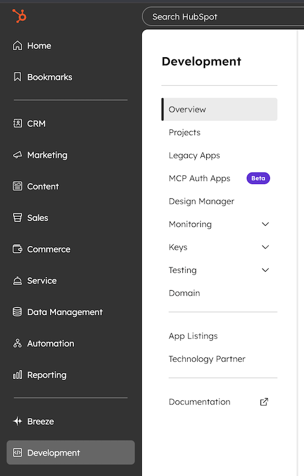
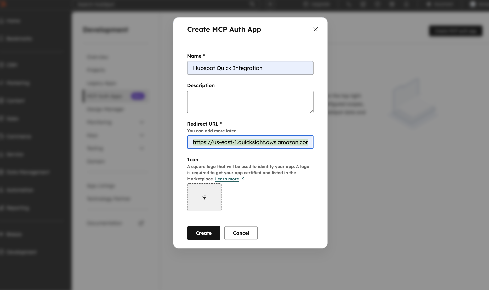
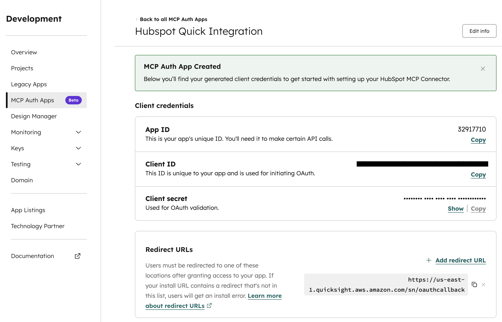
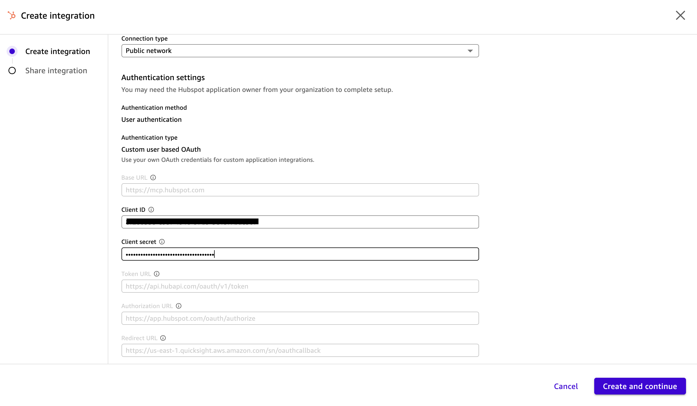
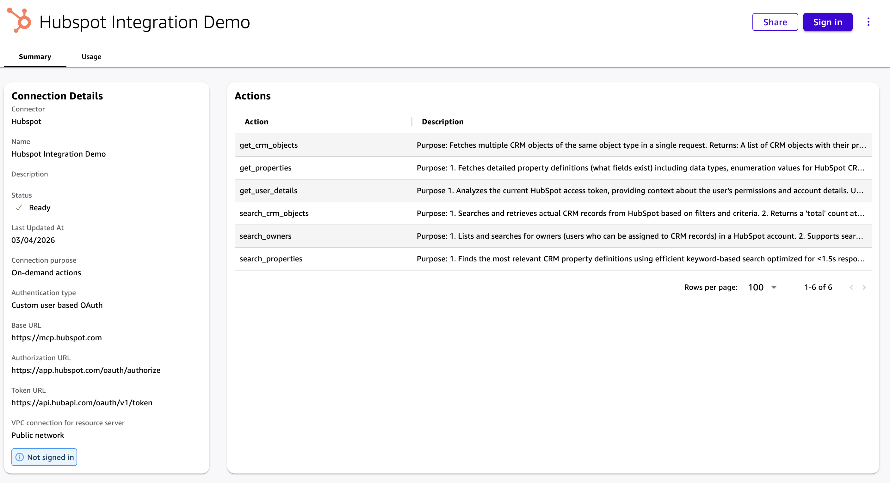
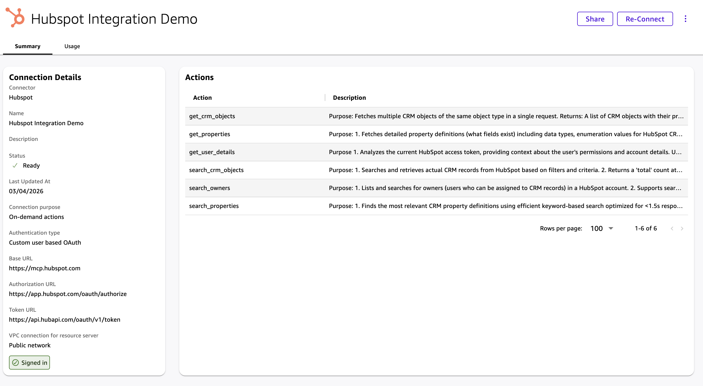

# HubSpot - Action Setup Guide

HubSpot is a powerful CRM and marketing service that helps teams manage customer relationships, automate workflows, and drive growth. If you're a HubSpot user, you can create an Amazon Quick Action to search and retrieve CRM records from within Amazon Quick.

Follow the step-by-step instructions to set up the HubSpot Action in your Amazon Quick account.

## HubSpot Pre-requisites

1) Log into your HubSpot account

2) From the homepage menu, select the `Development` menu option

3) Within the `Development` page, select the `MCP Auth Apps` menu option

4) Select `Create MCP auth app` to create a HubSpot app that your Amazon Quick account will connect to

5) Give your app a name and a description

6) For the redirect URL, enter `https://us-east-1.quicksight.aws.amazon.com/sn/oauthcallback` then click `Create` to finalize

7) Once created, your app will be assigned an App ID, Client ID and Client secret

## Quick Suite Actions Setup

8) Navigate to Quick Suite and click on `Integration`, then `Actions`

9) Select HubSpot to create an action integration

10) On HubSpot connection details page, give the integration a name, then insert the Client ID and Client secret that was assigned to the app you created in HubSpot

11) Click `Create and continue`

12) Once created, you will see the newly created HubSpot action integration in the list of `Existing actions`

13) Select the newly created HubSpot action integration, where you will see a list of actions that can be invoked within Amazon Quick. Select `Sign in` to successfully finalize the integration

14) The sign-in page will open a seperate HubSpot page where you will need to confirm the HubSpot account you wish to connect to Amazon Quick. This must be the same HubSpot account in which your app with the client ID and client secret you used exists

15) After signing in, the action summary page should show as `Signed in`

You can now begin testing Amazon Quick with the HubSpot action integration!