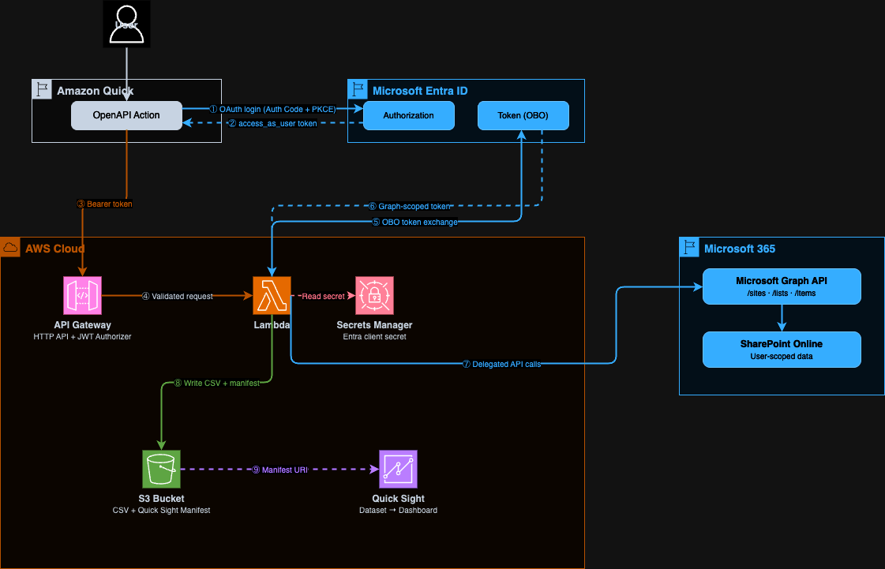

# Export SharePoint List to Amazon Quick Sight Dataset

This project lets users export SharePoint lists to Amazon Quick Sight through natural language in Amazon Quick. A user asks Quick to export a list, Quick calls a secure REST API, and the list data lands in S3 as a CSV with a Quick Sight manifest — ready to build a dashboard from.

Note:

- **Every API call is scoped to the authenticated user's SharePoint permissions.** The system never uses application-level access to SharePoint. If a user cannot read a list in SharePoint, they cannot export it through this API.
- **Why not use the SharePoint native Quick integration?** Lists can exceed thousands of rows and exporting data to Amazon S3 from Quick still requires a custom integration over S3. This solution leverages your Microsoft credentials and your infrastructure to export data. You can schedule this export by using Amazon Quick Flows and refresh the data periodically in Amazon Quick Sight datasets.

---

## How It Works

1. A user in Amazon Quick asks to search for SharePoint sites, browse lists, or export a list
2. Amazon Quick calls the API by using the user's Entra OAuth token (delegated permissions)
3. API Gateway validates the JWT — checking issuer, audience, and scope
4. The Lambda function exchanges the user's token for a Microsoft Graph token by using the **On-Behalf-Of (OBO) flow**
5. The Lambda calls Microsoft Graph API with the Graph token — only data the user can access is returned
6. For exports, the Lambda writes list items to S3 as CSV alongside a Quick Sight manifest file
7. The user pastes the manifest URI into Quick Sight to create a dataset and build dashboards



---

## API Operations

| Operation | Method | Path | Description |
|---|---|---|---|
| `search_sites` | GET | `/sites?query=` | Search SharePoint sites the user has access to |
| `list_lists` | GET | `/sites/{site_id}/lists` | Get all lists in a SharePoint site |
| `export_list` | POST | `/sites/{site_id}/lists/{list_id}/export` | Export a list to CSV + Quick Sight manifest in S3 |

---

## Security Model

This project uses **delegated user authentication end to end**. The project doesn't use a service account, application-level SharePoint access, or stored user credentials.

### How the On-Behalf-Of (OBO) Flow Works

The OBO flow is an OAuth 2.0 extension defined in [RFC 8693 (Token Exchange)](https://datatracker.ietf.org/doc/html/rfc8693) and implemented by Microsoft Entra. It allows a middle-tier service (this Lambda) to call a downstream API (Microsoft Graph) on behalf of the user who initiated the request — without the user needing to re-authenticate.

**Step by step:**

1. Amazon Quick authenticates the user against your Entra app registration by using Authorization Code + PKCE
2. The user receives an access token scoped to `api://{client-id}/access_as_user` — a custom scope on your app
3. Amazon Quick sends this token to API Gateway in the `Authorization: Bearer` header
4. API Gateway's JWT authorizer validates the token: issuer must be `https://login.microsoftonline.com/{tenant-id}/v2.0`, audience must be your client ID
5. The Lambda extracts the bearer token and calls Entra's token endpoint with:
   - `grant_type=urn:ietf:params:oauth:grant-type:jwt-bearer`
   - `assertion=<user's token>`
   - `requested_token_use=on_behalf_of`
   - `scope=https://graph.microsoft.com/.default`
6. Entra validates that the user consented to `Sites.Read.All` and issues a new Graph-scoped token **for that user**
7. The Lambda calls Microsoft Graph with this token — Graph enforces the user's SharePoint permissions

**References:**

- [Microsoft identity platform and OAuth 2.0 On-Behalf-Of flow](https://learn.microsoft.com/en-us/entra/identity-platform/v2-oauth2-on-behalf-of-flow)
- [Microsoft Graph permissions reference — Sites.Read.All](https://learn.microsoft.com/en-us/graph/permissions-reference#sitesreadall)
- [Configure delegated permissions for Microsoft Graph](https://learn.microsoft.com/en-us/graph/auth-v2-user)

### What This Means for Data Access

- A user can only export lists they can read in SharePoint
- The Lambda never stores user tokens
- AWS Secrets Manager stores the Entra client secret (used only for the OBO exchange), and the secret is never exposed to users
- API Gateway rejects any request with an invalid, expired, or incorrectly scoped token before it reaches the Lambda

---

## Prerequisites

- AWS account with Amazon Quick and Amazon Quick Sight enabled
- Microsoft 365 tenant with SharePoint
- Access to the Microsoft Entra admin center (Global Administrator or Application Administrator role)
- Node.js 18+ and AWS CDK CLI (`npm install -g aws-cdk`)
- Python 3.12+ and [uv](https://docs.astral.sh/uv/)
- Docker or finch to build the AWS Lambda images

---

## Step 1 — Register a Microsoft Entra Application

This app registration is the identity bridge between Amazon Quick and Microsoft Graph. Amazon Quick authenticates users against it, and the Lambda uses it to perform the OBO exchange.

### 1.1 Create the Registration

1. Open the [Microsoft Entra admin center](https://entra.microsoft.com/)
2. Go to **Identity** → **Applications** → **App registrations**
3. Choose **New registration**
4. Fill in:
   - **Name**: `Amazon Quick SharePoint Export`
   - **Supported account types**: `Accounts in this organizational directory only`
   - **Redirect URI**: Platform = **Web**, URI = `https://{region}.quicksight.aws.amazon.com/sn/oauthcallback`
     > Replace `{region}` with your AWS Region (for example, `us-east-1`)
5. Choose **Register**

### 1.2 Record Your IDs

From the app registration **Overview** page, copy:

| Value | Where to find it | Used in |
|---|---|---|
| **Application (client) ID** | Overview page | CDK deploy, Amazon Quick config |
| **Directory (tenant) ID** | Overview page | CDK deploy, Amazon Quick config |

### 1.3 Create a Client Secret

1. Choose **Certificates & secrets** → **New client secret**
2. Enter a description (for example, `Amazon Quick SharePoint Lists Export Secret`) and choose an expiry
3. Choose **Add**
4. **Copy the Value immediately** — it appears only once

> The Lambda uses this secret for the OBO token exchange only. AWS Secrets Manager stores the secret, and it is never sent to users or Amazon Quick.

### 1.4 Set Token Version to v2.0

The API Gateway JWT authorizer requires v2.0 tokens.

1. Choose **Manifest**
2. Find `accessTokenAcceptedVersion` and change it to `2`:
   ```json
   "accessTokenAcceptedVersion": 2
   ```
3. Choose **Save**

### 1.5 Add API Permissions

1. Choose **API permissions** → **Add a permission** → **Microsoft Graph** → **Delegated permissions**
2. Search for and add:
   - `Sites.Read.All` — Read items in all site collections on behalf of the signed-in user
   - `offline_access` — Maintain access to data the user has granted access to
3. Choose **Grant admin consent for [your tenant name]**
4. Confirm all permissions show **Granted** status

> `Sites.Read.All` is a delegated permission — it only grants access to sites the signed-in user can already access. For details, see [Microsoft's documentation](https://learn.microsoft.com/en-us/graph/permissions-reference#sitesreadall).

### 1.6 Expose an API (Custom Scope)

This creates the `access_as_user` scope that Amazon Quick requests when authenticating users. The Lambda validates this scope is present before performing the OBO exchange.

1. Choose **Expose an API**
2. Next to **Application ID URI**, choose **Add** — accept the default `api://{client-id}`
3. Choose **Add a scope**:
   - **Scope name**: `access_as_user`
   - **Who can consent**: Admins and users
   - **Admin consent display name**: `Access SharePoint Export`
   - **Admin consent description**: `Allow the app to export SharePoint lists on behalf of the user`
   - **State**: Enabled
4. Choose **Add scope**

---

## Step 2 — Deploy the AWS Infrastructure

The CDK stack deploys API Gateway, Lambda, S3, and Secrets Manager. The `ResolvedOpenApiSpec` output is the fully populated OpenAPI spec you paste into Amazon Quick.

### 2.1 Install Dependencies

```bash
cd infra
npm install
```

### 2.2 Deploy

```bash
npx cdk deploy \
  -c entraTenantId=YOUR_TENANT_ID \
  -c entraClientId=YOUR_CLIENT_ID
```

### 2.3 Store the Client Secret

The stack creates a Secrets Manager secret named `QuickSpExport/entra-client-secret`. Populate it with the secret value from Step 1.3:

```bash
aws secretsmanager put-secret-value \
  --secret-id QuickSpExport/entra-client-secret \
  --secret-string 'YOUR_CLIENT_SECRET_VALUE'
```

> **Important:** Do not invoke the Lambda before storing the secret. The Lambda reads the secret at cold start, and if the secret is empty, the OBO token exchange fails.

### 2.4 Stack Outputs

After deployment, CDK prints these outputs. Keep them handy for the next steps.

| Output | Description |
|---|---|
| `ApiEndpoint` | API Gateway endpoint URL |
| `ExportBucketName` | S3 bucket name for exported CSV and manifest files |
| `QuickIntegrationClientId` | Entra client ID — paste into Amazon Quick |
| `QuickIntegrationTokenUrl` | Entra token URL — paste into Amazon Quick |
| `QuickIntegrationAuthorizationUrl` | Entra authorization URL — paste into Amazon Quick |
| `ResolvedOpenApiSpec` | Fully resolved OpenAPI spec JSON — for use with Amazon Quick OpenAPI integration |

### What Gets Deployed

| Resource | Purpose |
|---|---|
| **API Gateway HTTP API** | Routes requests, enforces Entra JWT authorization |
| **Lambda Function** | Handles OBO exchange, calls Microsoft Graph, writes to S3 |
| **S3 Bucket** | Stores exported CSV files and Quick Sight manifest files |
| **Secrets Manager Secret** | Stores the Entra client secret for OBO exchange |

---

## Step 3 — Configure the OpenAPI Plugin in Amazon Quick

### 3.1 Create the Integration

1. In the [Amazon Quick console](https://quicksight.aws.amazon.com/), choose **Integrations** → **Actions**
2. Choose **OpenAPI Specification**
3. Paste the entire `ResolvedOpenApiSpec` output from Step 2.4 into the spec field
   > This is the complete OpenAPI 3.0 JSON with your API endpoint, client ID, and tenant ID already populated. You can also retrieve it from the CloudFormation stack outputs at any time.
4. Choose **Next**

### 3.2 Configure Authentication

Choose **OAuth 2.0** and fill in:

| Field | Value |
|---|---|
| **Client ID** | `QuickIntegrationClientId` output from Step 2.4 |
| **Client secret** | Client secret value from Step 1.3 |
| **Token URL** | `QuickIntegrationTokenUrl` output from Step 2.4 |
| **Authorization URL** | `QuickIntegrationAuthorizationUrl` output from Step 2.4 |
| **Redirect URL** | `https://{region}.quicksight.aws.amazon.com/sn/oauthcallback` |

### 3.3 Review and Activate

1. Amazon Quick connects to the API and discovers three operations: `search_sites`, `list_lists`, `export_list`
2. Review the operations and test to verify they are working properly
3. Share the integration with users who need access once verification is complete

### 3.4 First Use — User Authentication

The first time a user invokes any operation:

1. Amazon Quick redirects the user to the Microsoft Entra login page
2. The user signs in with their Microsoft 365 account
3. The user is prompted to consent to the `access_as_user` scope
4. Amazon Quick stores the token and uses it for subsequent calls

---

## Step 4 — Export a List and Create a Quick Sight Dataset

### 4.1 Export a List in Amazon Quick

Users interact through natural language:

> "Search for SharePoint sites with 'your site' in the name"

> "Show me the lists in that site"

> "Export the 'your list' list to S3"

The export response includes:

- `manifest_s3_uri` — the S3 URI to use when creating the Quick Sight dataset
- `instructions` — step-by-step instructions tailored to your specific export
- `row_count` and `columns` — confirmation of what was exported

### 4.2 Grant Quick Sight Access to the S3 Bucket (Admin-Led Process)

This is a one-time setup per Quick Sight account.

1. In Quick Sight, choose your profile icon → **Manage Quick Sight**
2. Choose **Security & permissions** → **Manage** under Quick Sight access to AWS services
3. Enable **Amazon S3** → choose **Select S3 buckets**
4. Check the `ExportBucketName` bucket from Step 2.4
5. Choose **Finish** → **Update**

### 4.3 Create the Dataset

1. Open Amazon Quick Sight and choose **Datasets**
2. Choose **Create dataset** → **Create data source** → **Amazon S3**
3. Choose **Next**
4. Enter a data source name (for example, the name of your SharePoint list)
5. Enter the `manifest_s3_uri` from the export response
6. Choose **Connect**
7. Choose **Edit/Preview data** — make any necessary configurations, preview the data, and/or add calculated fields
8. Choose **Save & publish**

### 4.4 Build a Dashboard

1. From the dataset, choose **Use in analysis**
2. Drag fields onto the canvas to build visuals
3. Choose **Share** → **Publish dashboard**

### 4.5 Refresh Data

Re-export the list in Amazon Quick at any time — the CSV overwrites the same stable S3 path. Then in Quick Sight, open the dataset and choose **Refresh now**, or configure a scheduled refresh.

---

## Project Structure

```
├── backend/
│   ├── src/
│   │   ├── api_handler.py                       # Lambda entry point (Powertools HTTP resolver)
│   │   ├── activities/
│   │   │   ├── search_sites_activity.py
│   │   │   ├── list_lists_activity.py
│   │   │   └── export_list_activity.py
│   │   └── common/
│   │       ├── services/
│   │       │   ├── graph_api_client.py           # Microsoft Graph API client (paginated)
│   │       │   ├── obo_token_exchanger.py        # Entra OBO token exchange
│   │       │   └── token_extractor.py            # Bearer token extraction + OBO
│   │       ├── dao/s3_dao.py                     # S3 upload
│   │       ├── models.py                         # Pydantic request/response models
│   │       ├── exceptions.py
│   │       ├── env.py
│   │       └── observability.py
│   ├── tests/
│   ├── pyproject.toml
│   └── Makefile
├── infra/
│   ├── lib/
│   │   ├── app.ts
│   │   ├── stacks/sharepoint-export-stack.ts     # Stack with all outputs
│   │   ├── constructs/api-gateway-lambda.ts      # API Gateway + Lambda + JWT authorizer
│   │   ├── construct-groups/storage-buckets.ts
│   │   └── common/config.ts
│   ├── package.json
│   └── cdk.json
└── test-data/
    ├── helpdesk-tickets.csv                      # 1,000 sample IT help desk tickets
    └── README.md                                 # Schema and Quick Sight dashboard ideas
```

---

## Development

```bash
cd backend
make install      # install dependencies
make check        # lint + unit tests
make test-unit    # unit tests only
make test-cov     # unit tests with HTML coverage report
```

---

## Troubleshooting

| Symptom | Cause | Fix |
|---|---|---|
| `403 Access denied` from Graph API | `Sites.Read.All` admin consent not granted | In Entra → API permissions → Grant admin consent |
| `401 Unauthorized` from API Gateway | Token audience mismatch | Verify `entraClientId` in CDK matches the Client ID in Amazon Quick |
| `AADSTS50020` error | Wrong tenant ID | Verify `entraTenantId` in CDK matches your Directory (tenant) ID |
| `AADSTS65001` error | User has not consented | User must sign in and consent to `access_as_user` scope |
| Export returns `InternalFailureException` in Quick | Missing request body | Verify the OpenAPI spec includes `requestBody` on the export POST operation |
| CSV has `field_1`, `field_2` column names | Old deployment | Redeploy — column display names are now used |
| Quick Sight cannot read the manifest | S3 access not granted | Grant Quick Sight access to the S3 bucket in Security & permissions |
| Client secret expired | Entra secret rotation | Create a new secret in Entra, update Secrets Manager, redeploy |
